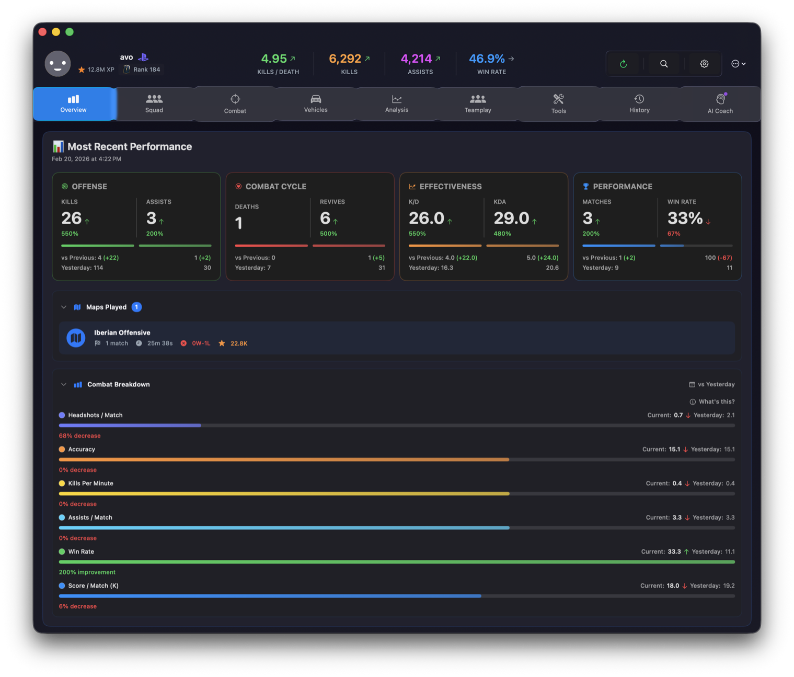
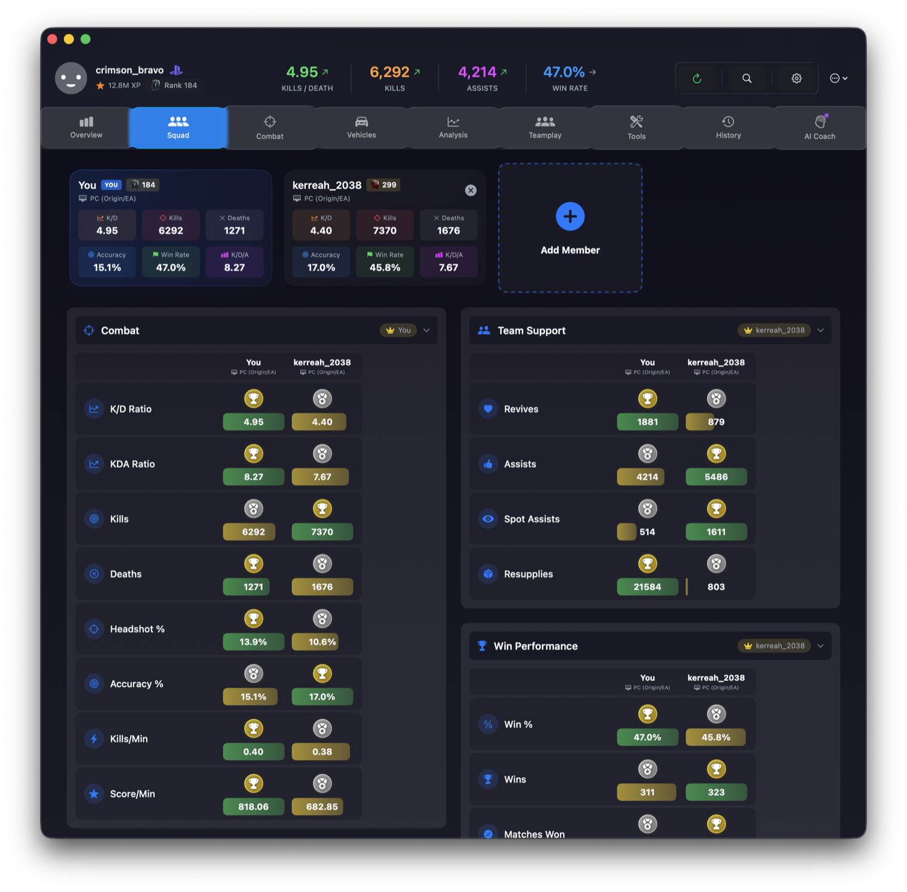
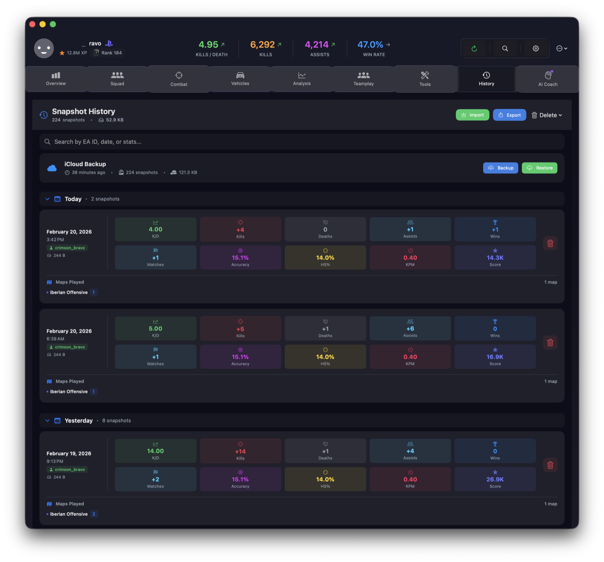
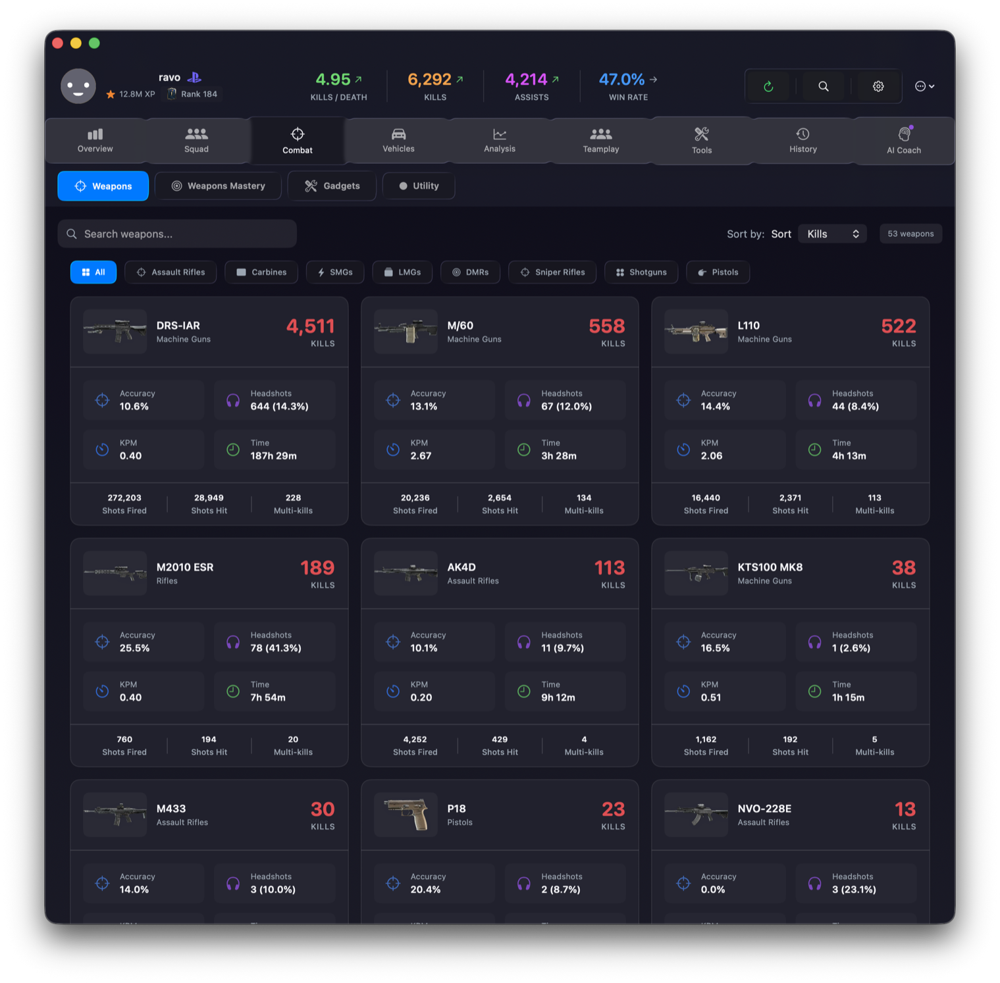
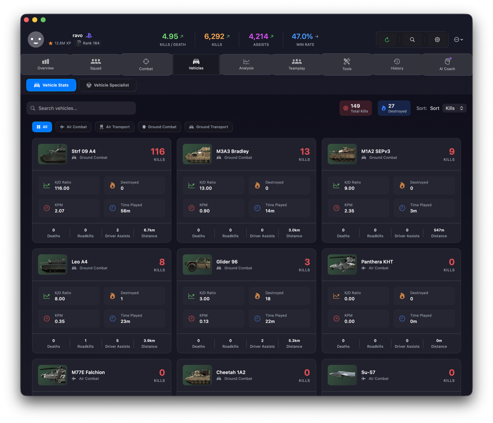
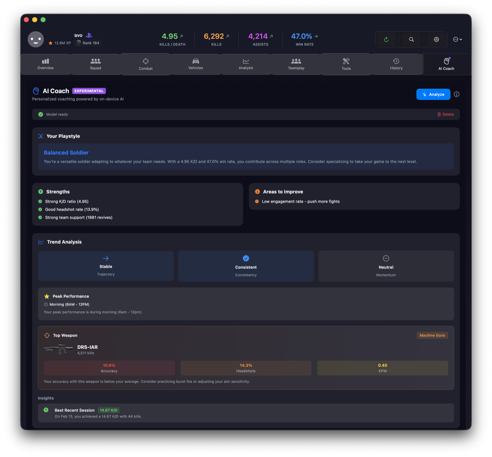
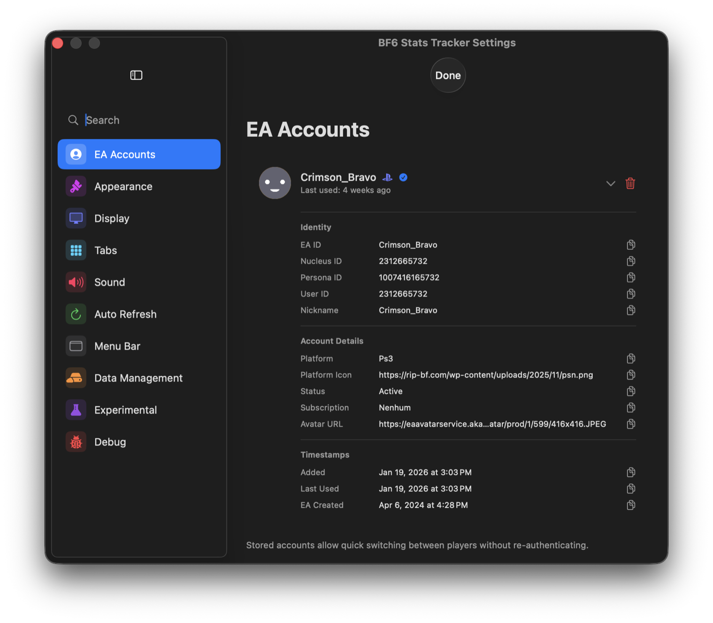

# BF6 Stats Tracker

<div align="center">


[](https://github.com/MikeManzo/BF6StatsTracker/actions/workflows/build.yml)

**Track your Battlefield 6 stats with historical analytics, squad comparison, and on-device AI coaching**

[Features](#features) • [Installation](#installation) • [Usage](#usage)

</div>

---

## Screenshots

### Main Dashboard
Track your performance at a glance with key stats, recent matches, and performance trends.



### Squad Comparison
Compare stats with your squad members side-by-side with detailed breakdowns.



### Snapshot History
View your session-by-session performance with detailed stat deltas and trends over time.



### Weapon Statistics
Browse all weapons by category with detailed stats including kills, accuracy, and headshot percentages.



### Vehicle Performance
Track your effectiveness across all vehicle types with comprehensive stats.



### Performance Charts
Visualize your progression with interactive charts showing K/D trends, kills, and performance metrics.


### AI Coach
Get personalized tips and recommendations based on your playstyle with on-device AI analysis.



### Settings
Manage your EA account, customize appearance, configure auto-refresh, and control your data.



---

## Features

### Stats Tracking
- Complete player statistics - K/D, accuracy, win rate, score per minute
- 45+ weapons with kills, accuracy, headshots, and damage stats
- Vehicle performance across 8 categories
- Class breakdowns with time played and effectiveness
- Gadget and utility tracking
- Per-map statistics with performance ratings

### Historical Data
All your data stays private on your Mac. The app automatically saves snapshots when you refresh, letting you track:
- Performance trends over time
- Session-by-session improvements
- Which maps you played and when
- K/D, accuracy, and kills per minute progression

The history view shows your last two days expanded by default, with stats displayed in an easy-to-scan grid with icons.

### Squad & Friends
- Add squad members and compare stats side-by-side
- Automatic EA ID lookup
- Rank badges and KDA tracking
- Friends comparison (work in progress)

### AI Coach (Experimental)
Get personalized tips based on your playstyle. All analysis happens on your Mac - nothing leaves your computer. Requires macOS 15+ with Apple Silicon.

### Combat Analysis
- **Weapon Mastery**: Browse weapons by category with sidebar navigation
- **Vehicle Specialist**: Same sidebar layout for vehicles
- **Gadgets & Utility**: Track effectiveness of equipment
- **Loadout Analyzer**: Get recommendations for better loadouts

### Performance Analytics
- Charts showing trends over time
- Map-specific performance with win rates
- Game mode efficiency breakdown
- Best and worst performing areas highlighted

### Tools
- **Server Browser**: Find and favorite BF6 servers
- **System Logs**: Debug view with filtering and search
- **EA Account**: Optional login for automatic player detection

---

## Installation

**Requirements:** macOS 14.0 or later

1. Clone this repo and open in Xcode 15+
2. Select your development team for signing
3. Build and run (⌘R)

All your data is stored locally at `~/Library/Application Support/BF6StatsTracker/`

---

## Usage

### Getting Started

**With EA Account** (easier)
1. Click "Sign in with EA" when you launch
2. Authenticate and you're done

**Without EA Account**
1. Click "Manual Setup"
2. Enter your player name and platform
3. Click Save

### Navigation

Use ⌘1-9 to switch between tabs:
- Overview (⌘1) - Dashboard with key stats
- Squad (⌘2) - Compare with squad members
- History (⌘3) - Session history with deltas
- Combat (⌘4) - Weapons, gadgets, utility
- Vehicles (⌘5) - Vehicle stats and specialist view
- Analysis (⌘6) - Charts, maps, modes
- Teamplay (⌘7) - Classes, support, loadouts
- Tools (⌘8) - Logs and server browser
- AI Coach (⌘9) - On-device performance tips

Other shortcuts:
- ⌘R to refresh stats
- ⌘F to search players
- ⌘, for settings

### Settings

- **EA Account**: Connect or disconnect your account
- **Display**: Choose accent color, enable Liquid Glass (macOS 26+)
- **Auto Refresh**: Set how often stats update (1-30 min)
- **AI Coach**: Enable experimental AI features (requires macOS 15+)
- **Data**: View storage usage, clear cache, export/import history

---

## Privacy

- All historical data stored locally using SwiftData
- AI Coach runs entirely on your Mac (FoundationModels)
- Nothing sent to external servers except API calls for stats
- Clear all data anytime in Settings

---

## API

Uses the free [GameTools.Network](https://api.gametools.network) API for BF6 stats.

Cached for 5 minutes to reduce load. Rate limited to 1 request per second.

---

## Project Structure

```
BF6StatsTracker/
├── Models/          # Data structures and SwiftData models
├── Services/        # API, caching, history, AI
├── ViewModels/      # App state management
├── Views/           # All UI screens
│   └── Components/  # Reusable UI elements
└── Utilities/       # Helper functions
```

Built with SwiftUI, SwiftData, and Swift Charts.

---

## License

GPL-3.0 or later. See license file for details.

---

## Disclaimer

Not affiliated with EA, EA DICE, or Battlefield. All trademarks belong to their respective owners.

AI Coach provides statistical suggestions only, not professional gaming advice.

---

## Credits

- [GameTools.Network](https://gametools.network) for the stats API
- Battlefield community for feedback
- Apple frameworks (SwiftUI, SwiftData, FoundationModels)

---

<div align="center">

**Made for Battlefield players**

[Report Issues](../../issues) • [Request Features](../../issues)

</div>
